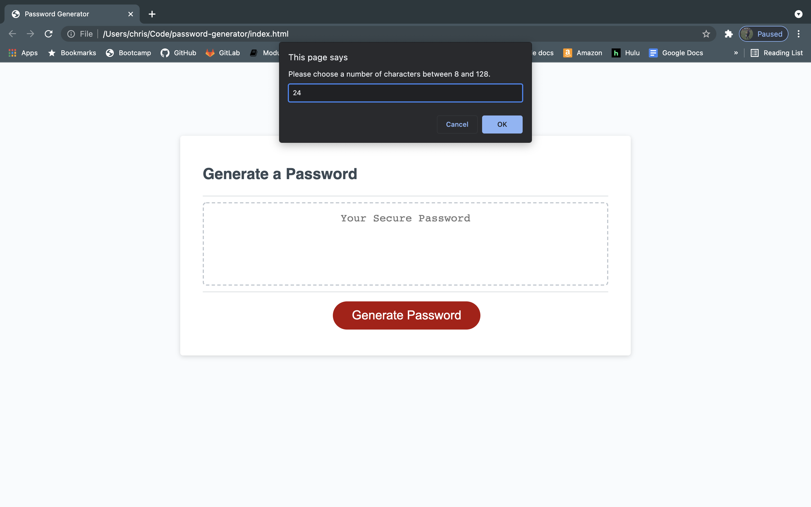
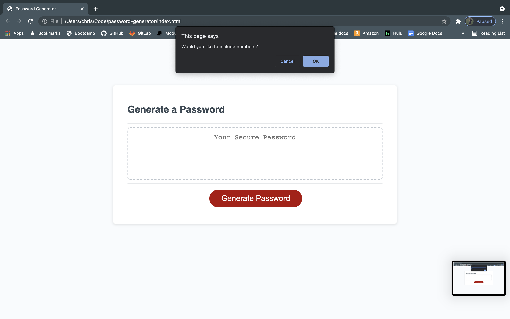
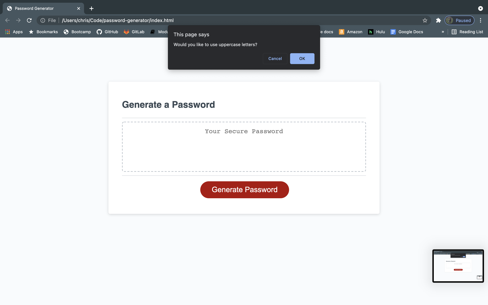
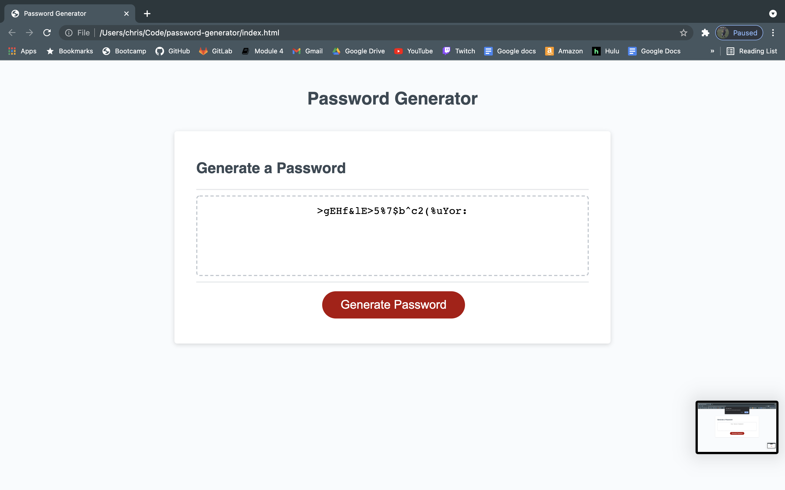

# password-generator
using JS to create a random password generator

# Links 

[my-Portfolio Github URL](https://cavazosdotcom.github.io/password-generator/)

[my-Portfolio Github Repo URL](https://github.com/cavazosdotcom/password-generator)

# Picture

# JS

- With my, and might I emphasize, VERY BRIEF exposure to python many years ago, some of these basic concepts of JS such as creating variables, arrays, conditions, etc. come to me much easier than the previous html and css from the previous weeks. I started creating the `generatePassword()` function by writing out all my pseudocode, and trying to understand how I plan on structuring this assignment. My biggest difficulty is putting that pseudocode to actual code using a much different syntax in JS. Starting is my hardest part because I want to start in different ways using my python techniques but I have to work hard to remember JS and transition my brain to instictively think differently using this language and syntax. 

- I decided to concat my characters array with an if statement which each confirm instead of a larger else if chain with each different outcome using `or` and `and`, etc. to make the code more dry (I think I used that correctly?)

- The `isNAN()` function was really cool to try out, I could have used typeof() but this seemed cooler to try